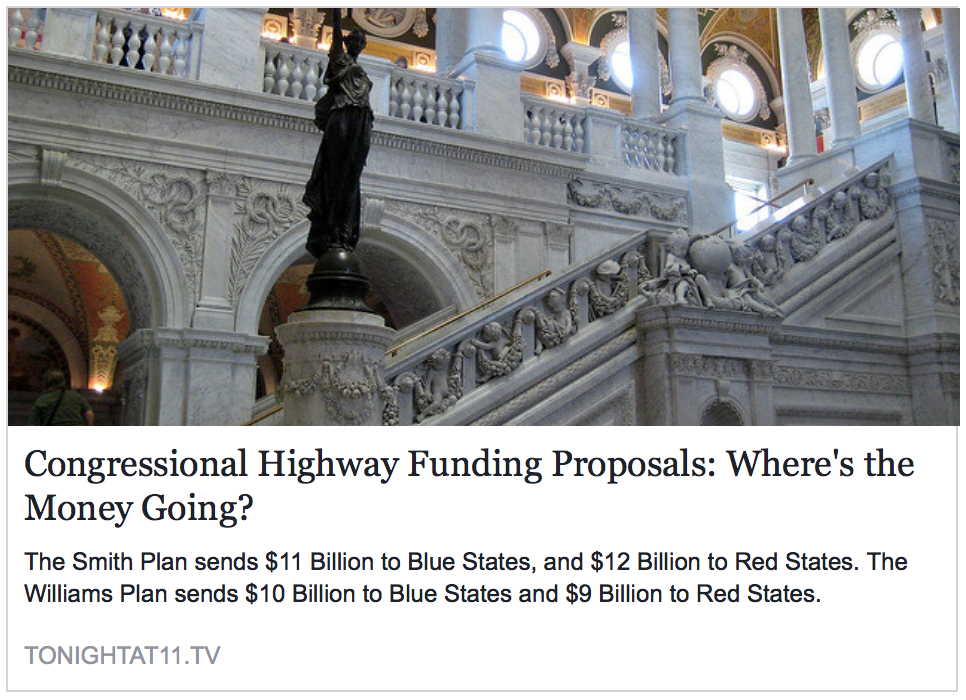
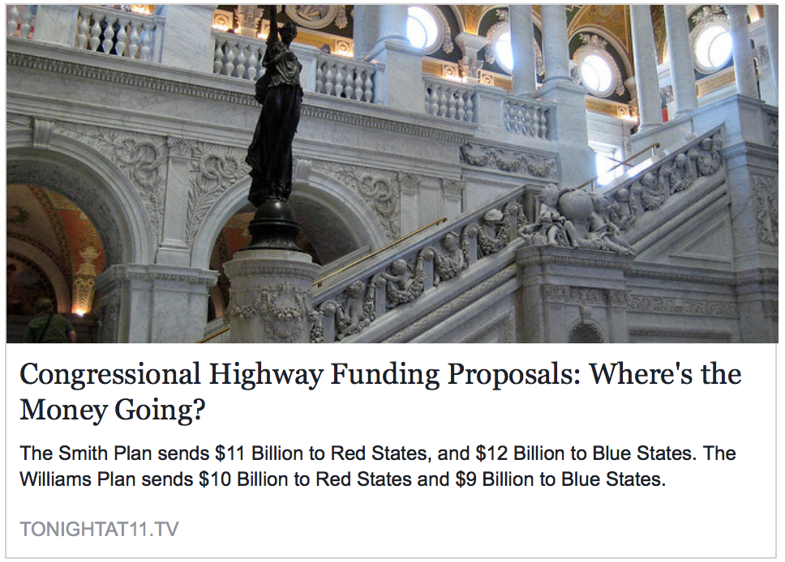

## Pareto Partisan: Are Partisans Willing to Bite Their Purse To Spite The Main Opposing Party?

One of the deepest concerns about group-based affect is that partisans will take an option that is worse for everyone compared to an option that is better for everyone except where the supporters of the main opposing party benefit more than co-partisans. We test this with a survey experiment on the CCES. We find that just a third of the Democrats and a fourth of the Republicans choose the plan that allocates the most money.

### Treatments

Which plan do you support? — Smith Plan or Williams Plan?

-----

We also asked a similar question that probes the policy consequences of racial affect.

John Bowen, a candidate seeking your party's nomination for Congress in another state has made a new jobs plan the centerpiece of his campaign.  His plan has received a lot of media attention. The bipartisan Congressional Budget Office has evaluated his plan and concluded it will help create jobs, but that the benefits will not be the same for all Americans. 

  Specifically, the report predicts that the average black family making \\$50,000 will see a 7 percent increase in income and the average white family making $50,000 will see a 5 percent increase in income.

  Specifically, the report predicts that the average white family making \\$50,000 will see a 7 percent increase in income and the average black family making $50,000 will see a 5 percent increase in income.

Based on this information, how likely would you be to vote for John in this primary?

Extremely Likely
Very Likely
Somewhat Likely
Somewhat Unlikely
Very Unlikely
Extremely Unlikely

### Results

We find that 

"
from matched:

268      1   Smith Plan
580      2   Williams Plan
3      8   skipped
149      9   not asked
"

"
Name:          UCMjobstreat
Description:   UCMjobs treatment
         
          Count   Code   Label
          -----   ----   -----
            509      1   Black
            491      2   White
         
================================================================================
Name:          UCMjobsparty
Description:   UCMjobsparty treatment
         
          Count   Code   Label
          -----   ----   -----
            554      1   Democrat
            446      2   Republican

Single Choice

Name:          UCMjobs
Description:   Vote for John
         
          Count   Code   Label
          -----   ----   -----
             95      1   Extremely likely
            199      2   Very likely
            349      3   Somewhat likely
            203      4   Somewhat unlikely
             81      5   Very unlikely
             73      6   Extremely unlikely

"

### Authors

Gaurav Sood and Alex Theodoridis
